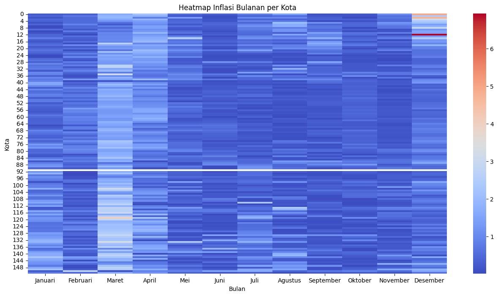

# 📊 Indonesia Monthly Inflation Analysis

This project analyzes **monthly inflation data across cities in Indonesia** using Python.

The analysis focuses on data cleaning, transformation, and visualization to understand inflation patterns between cities and months.

This project demonstrates a typical **Data Analyst workflow** including data preprocessing, exploratory analysis, and visualization.

---

# 📌 Objectives

The objectives of this project are:

- Clean raw statistical data
- Transform the dataset into an analyzable format
- Calculate Month-to-Month inflation changes
- Visualize inflation patterns using heatmaps
- Extract meaningful insights from economic data

---

# 🛠 Tools & Libraries

The project uses the following tools:

- Python
- Pandas
- Matplotlib
- Seaborn
- Jupyter Notebook

---

# 📂 Project Workflow

### 1 Data Collection
Dataset sourced from statistical publications.

### 2 Data Cleaning
Data cleaning steps include:

- Fixing incorrect headers
- Removing missing symbols (`-`)
- Converting string values to numeric format
- Renaming columns

### 3 Data Transformation
Month-to-Month inflation is calculated using:

```python
df.pct_change()
```

### 4 Data Visualization

Inflation patterns are visualized using **heatmap visualization**.

---

# 📈 Example Visualization



This heatmap helps identify:

- Cities with the highest inflation
- Monthly inflation trends
- Regional inflation patterns

---

# 💡 Key Skills Demonstrated

- Data Cleaning
- Data Transformation
- Exploratory Data Analysis (EDA)
- Data Visualization
- Python for Data Analysis
- Economic Data Interpretation

---

# 👨‍💻 Author

Created as part of a **Data Analyst portfolio project** to demonstrate the ability to process and analyze economic datasets using Python.
